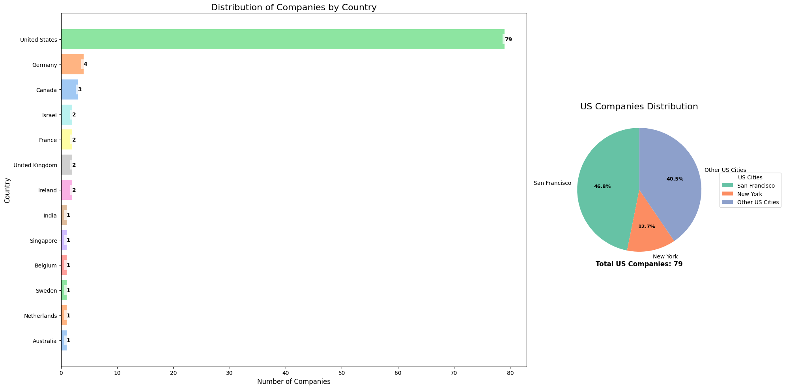
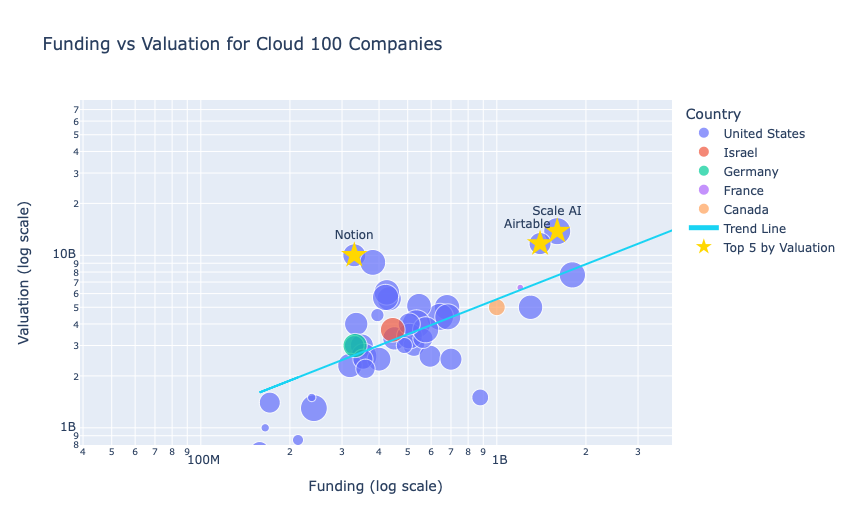
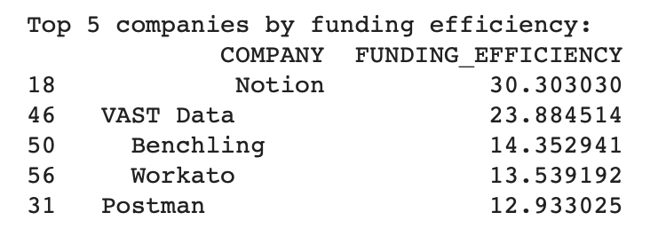
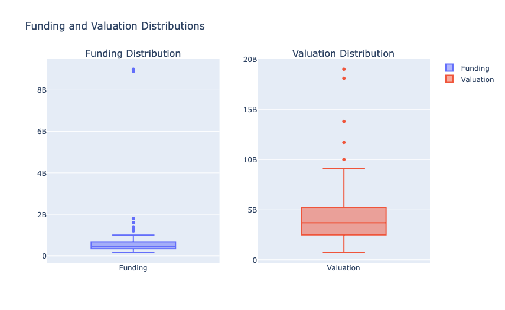

# Forbes Cloud 100 Analysis
source: (https://www.forbes.com/lists/cloud100/)


This project analyzes data from "The Cloud 100 - 2024" dataset, which ranks the top 100 private cloud companies. The analysis includes visualizations of company distributions by country, funding vs. valuation relationships, and other key metrics.

## Dataset

The dataset !(files/The Cloud 100 - 2024.csv) contains information about the top 100 cloud companies, including:

- Rank
- Company name
- CEO
- Headquarters location
- Number of employees
- Company description
- Funding amount
- Valuation

## Features

1. **Country Distribution Analysis**
   - Visualizes the distribution of companies by country
   - Provides a detailed breakdown of US-based companies



2. **Funding vs. Valuation Analysis + Statistical Analysis**
   - Interactive scatter plot comparing funding and valuation
   - Logarithmic scales for better visualization
   - Includes company size (by number of employees) and country information
   - Trend line to show the general relationship between funding and valuation
   - Identifies and highlights the top 5 companies by valuation
   - Calculates the correlation between funding and valuation
   - Identifies the top 5 companies by funding efficiency (valuation to funding ratio)





3. **Distribution Analysis**
   - Box plots for funding and valuation distributions


## Requirements

- Python 3.x
- pandas
- matplotlib
- seaborn
- numpy
- scipy
- plotly

## Usage

1. Ensure all required libraries are installed:
   ```
   pip install pandas matplotlib seaborn numpy scipy plotly
   ```

2. Place the `The Cloud 100 - 2024.csv` file in the same directory as the script.

3. Run the script:
   ```
   python cloud_100_analysis.py
   ```

4. The script will generate several visualizations and print statistical information to the console.

## Visualizations

1. **Country Distribution**: A horizontal bar chart showing the number of companies per country, with a pie chart detailing the distribution of US-based companies.

2. **Funding vs. Valuation Scatter Plot**: An interactive plot showing the relationship between funding and valuation, with additional information on company size and country.

3. **Funding and Valuation Distributions**: Box plots showing the distribution of funding and valuation across the dataset.

## Results

The analysis provides insights into:
- The geographical distribution of top cloud companies
- The relationship between funding and valuation in the cloud industry
- Identification of top-performing companies based on various metrics
- The overall funding and valuation landscape of the top 100 cloud companies

## Future Improvements

- Add time-series analysis if historical data becomes available
- Implement machine learning models to predict valuations based on various factors
- Create a web dashboard for interactive exploration of the data

## Contributing

Feel free to fork this project and submit pull requests with any improvements or additional analyses.
